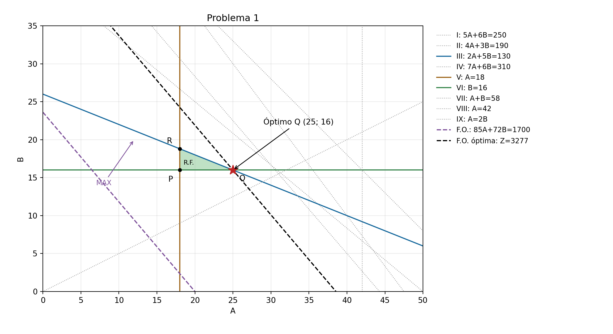
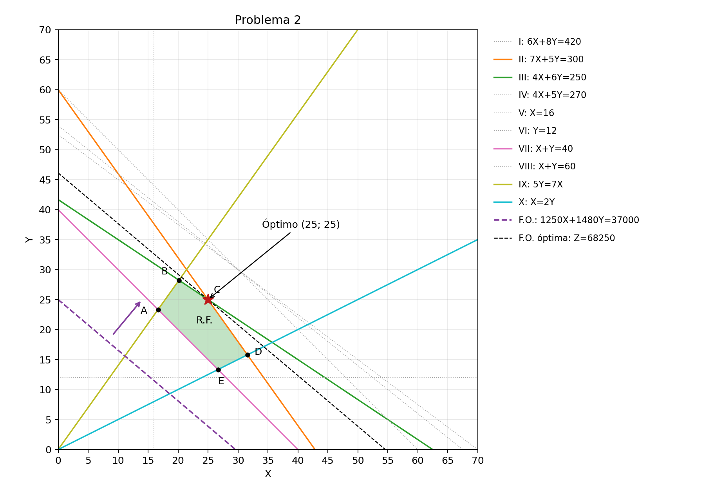
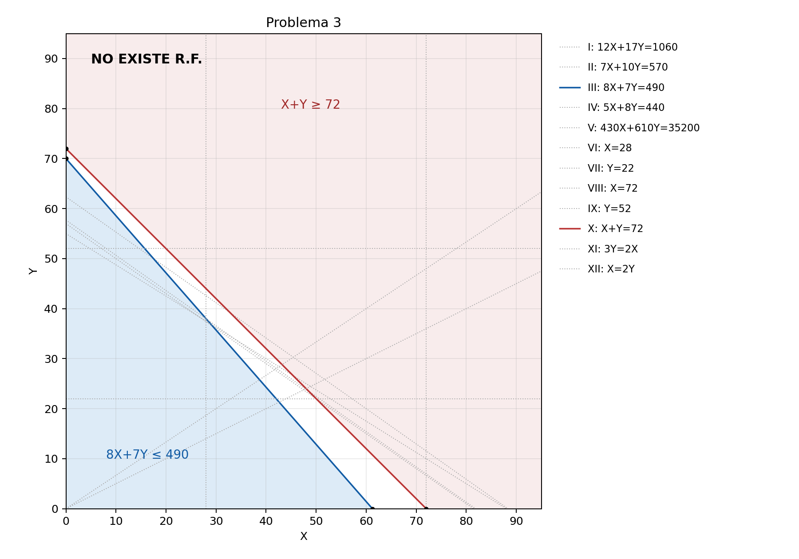

# PROBLEMA 1

## I. Identificación de las variables
A = unidades del producto A a producir.  
B = unidades del producto B a producir.  

## II. Identificación de la Función Objetivo
MAX Z = 85A + 72B  

## III. Identificación de las restricciones
(I) 5A + 6B ≤ 250  
(II) 4A + 3B ≤ 190  
(III) 2A + 5B ≤ 130  
(IV) 7A + 6B ≤ 310  
(V) A ≥ 18  
(VI) B ≥ 16  
(VII) A + B ≤ 58  
(VIII) A ≤ 42  
(IX) B ≥ A/2 → A − 2B ≤ 0  
A, B ≥ 0  

## PASO 1: Graficando las restricciones
(I) 5A + 6B = 250  
Si A=0 → B=125/3 ≈ 41,6667  
Si B=0 → A=50  

(II) 4A + 3B = 190  
Si A=0 → B=190/3 ≈ 63,3333  
Si B=0 → A=47,5  

(III) 2A + 5B = 130  
Si A=0 → B=26  
Si B=0 → A=65  

(IV) 7A + 6B = 310  
Si A=0 → B=155/3 ≈ 51,6667  
Si B=0 → A=310/7 ≈ 44,2857  

(V) A=18 y (VIII) A=42: verticales.  
(VI) B=16: horizontal.  

(VII) A + B = 58  
Si A=0 → B=58  
Si B=0 → A=58  

(IX) A − 2B = 0  
Si A=0 → B=0  
Si B=0 → A=0  
Otro punto: A=20 → B=10.  

## PASO 2: Hallando la Región Factible
P = V ∩ VI:  
A=18; B=16 → P=(18;16).  

Q = III ∩ VI:  
2A+5B=130  
B=16  
2A+5(16)=130 → 2A=50 → A=25.  
Q=(25;16).  

R = III ∩ V:  
2A+5B=130  
A=18  
2(18)+5B=130 → 5B=94 → B=18,8.  
R=(18;18,8).  

R.F. = triángulo PQR, incluidos sus lados.  

## PASO 3: Graficando la Función Objetivo
85A + 72B = 1700  
Si A=0 → B=425/18 ≈ 23,6111  
Si B=0 → A=20  
Desplazar paralelamente hacia valores mayores de Z hasta Q.  

## PASO 4: Hallando la Solución Óptima
A = 25  
B = 16  
Z = 85(25) + 72(16)  
Z = 2125 + 1152  
Z = S/ 3277  

## GRÁFICO


Escala A = 5 unidades por cuadrícula.  
Escala B = 5 unidades por cuadrícula.  
Puntos principales = P(18;16), Q(25;16), R(18;18,8); F.O.: (20;0), (0;23,6111).  

## VERIFICACIÓN LINDO 6.1

```text
MAX 85 A + 72 B
ST
5 A + 6 B <= 250
4 A + 3 B <= 190
2 A + 5 B <= 130
7 A + 6 B <= 310
A >= 18
B >= 16
A + B <= 58
A <= 42
A - 2 B <= 0
A >= 0
B >= 0
END
```

RESULTADO LINDO ESPERADO  
A = 25  
B = 16  
Z = 3277

## RESPUESTAS PARA LOS CASILLEROS

A = 25 unidades  
B = 16 unidades  
Z = S/ 3277

---

# PROBLEMA 2

## 1. MODELO MATEMÁTICO

**I. Identificación de las variables**  

X = toneladas de fertilizante X a producir.  
Y = toneladas de fertilizante Y a producir.  

**II. Identificación de la Función Objetivo**  

MAX Z = 1250X + 1480Y  

**III. Identificación de las restricciones**  

(I) 6X + 8Y ≤ 420 (nitrógeno)  
(II) 7X + 5Y ≤ 300 (fósforo)  
(III) 4X + 6Y ≤ 250 (potasio)  
(IV) 4X + 5Y ≤ 270 (procesamiento)  
(V) X ≥ 16  
(VI) Y ≥ 12  
(VII) X + Y ≥ 40  
(VIII) X + Y ≤ 60  
(IX) Y ≤ 1,4X → 5Y − 7X ≤ 0  
(X) X ≤ 2Y → X − 2Y ≤ 0  
X, Y ≥ 0  

## 2. MÉTODO GRÁFICO

**PASO 1: Graficando las restricciones**  

(I) 6X + 8Y = 420  
Si X=0 → Y=52,5  
Si Y=0 → X=70  

(II) 7X + 5Y = 300  
Si X=0 → Y=60  
Si Y=0 → X=300/7 ≈ 42,8571  

(III) 4X + 6Y = 250  
Si X=0 → Y=125/3 ≈ 41,6667  
Si Y=0 → X=62,5  

(IV) 4X + 5Y = 270  
Si X=0 → Y=54  
Si Y=0 → X=67,5  

(V) X=16: vertical. (VI) Y=12: horizontal.  

(VII) X + Y = 40  
Si X=0 → Y=40  
Si Y=0 → X=40  

(VIII) X + Y = 60  
Si X=0 → Y=60  
Si Y=0 → X=60  

(IX) 5Y − 7X = 0  
Si X=0 → Y=0  
Si Y=0 → X=0  
Otro punto: X=20 → Y=28.  

(X) X − 2Y = 0  
Si X=0 → Y=0  
Si Y=0 → X=0  
Otro punto: X=40 → Y=20.  

**PASO 2: Hallando la Región Factible**  

A = VII ∩ IX:  
X+Y=40; 5Y=7X  
5X+7X=200 → X=50/3; Y=70/3.  

B = III ∩ IX:  
4X+6Y=250; 5Y=7X  
20X+30Y=1250; 30Y=42X  
62X=1250 → X=625/31; Y=875/31.  

C = II ∩ III:  
7X+5Y=300 (II)  
4X+6Y=250 (III)  
II×6: 42X+30Y=1800  
III×5: 20X+30Y=1250  
Restando: 22X=550 → X=25  
7(25)+5Y=300 → Y=25.  

D = II ∩ X:  
7X+5Y=300; X=2Y  
14Y+5Y=300 → Y=300/19; X=600/19.  

E = VII ∩ X:  
X+Y=40; X=2Y  
3Y=40 → Y=40/3; X=80/3.  

R.F. = polígono ABCDE, incluidos sus lados.  
A=(16,6667; 23,3333), B=(20,1613; 28,2258),  
C=(25; 25), D=(31,5789; 15,7895), E=(26,6667; 13,3333).  

**PASO 3: Graficando la Función Objetivo**  

1250X + 1480Y = 37000  
Si X=0 → Y=25  
Si Y=0 → X=29,6  
Desplazar paralelamente hacia valores mayores de Z hasta C.  

**PASO 4: Hallando la Solución Óptima**  

X = 25 t  
Y = 25 t  
Z = 1250(25) + 1480(25)  
Z = 31250 + 37000 = S/ 68250  

**RESPUESTA:**  
X = 25 t  
Y = 25 t  
Z = S/ 68250  

## 3. GRÁFICO



Escala X = 5 toneladas por cuadrícula.  
Escala Y = 5 toneladas por cuadrícula.  
Puntos principales = A(16,6667;23,3333), B(20,1613;28,2258), C(25;25), D(31,5789;15,7895), E(26,6667;13,3333); F.O.: (0;25), (29,6;0).  

## 4. VERIFICACIÓN LINDO 6.1

```text
MAX 1250 X + 1480 Y
ST
6 X + 8 Y <= 420
7 X + 5 Y <= 300
4 X + 6 Y <= 250
4 X + 5 Y <= 270
X >= 16
Y >= 12
X + Y >= 40
X + Y <= 60
5 Y - 7 X <= 0
X - 2 Y <= 0
X >= 0
Y >= 0
END
```

**RESULTADO LINDO ESPERADO**  
X = 25  
Y = 25  
Z = 68250  

---  

# PROBLEMA 3

## 1. MODELO MATEMÁTICO

**I. Identificación de las variables**  

X = número de mesas industriales a fabricar por semana.  
Y = número de estaciones de trabajo a fabricar por semana.  

**II. Identificación de la Función Objetivo**  

MAX Z = 185X + 255Y  

**III. Identificación de las restricciones**  

(I) 12X + 17Y ≤ 1060 (acero)  
(II) 7X + 10Y ≤ 570 (mano de obra)  
(III) 8X + 7Y ≤ 490 (maquinado)  
(IV) 5X + 8Y ≤ 440 (ensamblaje)  
(V) 430X + 610Y ≤ 35200 (costo total)  
(VI) X ≥ 28  
(VII) Y ≥ 22  
(VIII) X ≤ 72  
(IX) Y ≤ 52  
(X) X + Y ≥ 72  
(XI) Y ≥ 0,40(X+Y) → 3Y − 2X ≥ 0  
(XII) X ≤ 2Y → X − 2Y ≤ 0  
X, Y ≥ 0  

## 2. MÉTODO GRÁFICO

**PASO 1: Graficando las restricciones**  

(I) 12X + 17Y = 1060  
Si X=0 → Y=1060/17 ≈ 62,3529  
Si Y=0 → X=265/3 ≈ 88,3333  

(II) 7X + 10Y = 570  
Si X=0 → Y=57  
Si Y=0 → X=570/7 ≈ 81,4286  

(III) 8X + 7Y = 490  
Si X=0 → Y=70  
Si Y=0 → X=61,25  

(IV) 5X + 8Y = 440  
Si X=0 → Y=55  
Si Y=0 → X=88  

(V) 430X + 610Y = 35200  
Si X=0 → Y=3520/61 ≈ 57,7049  
Si Y=0 → X=3520/43 ≈ 81,8605  

(VI) X=28 y (VIII) X=72: verticales.  
(VII) Y=22 y (IX) Y=52: horizontales.  

(X) X + Y = 72  
Si X=0 → Y=72  
Si Y=0 → X=72  

(XI) 3Y − 2X = 0  
Si X=0 → Y=0  
Si Y=0 → X=0  
Otro punto: X=30 → Y=20.  

(XII) X − 2Y = 0  
Si X=0 → Y=0  
Si Y=0 → X=0  
Otro punto: X=40 → Y=20.  

**PASO 2: Hallando la Región Factible**  

Intersección de III y X:  
8X+7Y=490  
X+Y=72 → 7X+7Y=504  
Restando: X=−14 → Y=86.  
(−14;86) no cumple X≥0.  

Además:  
X+Y≥72 → 7X+7Y≥504.  
X≥28 → 8X+7Y = 7(X+Y)+X ≥ 504+28 = 532 > 490.  

**NO EXISTE REGIÓN FACTIBLE.**  
**POR LO TANTO, NO EXISTE SOLUCIÓN ÓPTIMA.**  

## 3. GRÁFICO



Escala X = 10 unidades por cuadrícula.  
Escala Y = 10 unidades por cuadrícula.  
Puntos principales = III: (0;70), (61,25;0); X: (0;72), (72;0). No hay vértices factibles ni punto óptimo.  

## 4. VERIFICACIÓN LINDO 6.1

```text
MAX 185 X + 255 Y
ST
12 X + 17 Y <= 1060
7 X + 10 Y <= 570
8 X + 7 Y <= 490
5 X + 8 Y <= 440
430 X + 610 Y <= 35200
X >= 28
Y >= 22
X <= 72
Y <= 52
X + Y >= 72
3 Y - 2 X >= 0
X - 2 Y <= 0
X >= 0
Y >= 0
END
```

**RESULTADO LINDO ESPERADO**  
INFEASIBLE. No existen valores óptimos de X, Y ni Z.  
